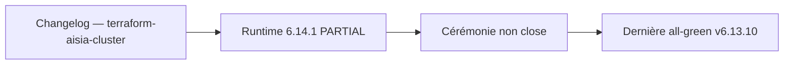

# Changelog — terraform-aisia-cluster

Format : [Keep a Changelog](https://keepachangelog.com/) · Versioning : SemVer.

## [6.14.1] — 2026-09-24

### Alignement de version — aucun changement fonctionnel

Les versions **6.12.81 à 6.14.1** ont été publiées sans entrée individuelle
dans ce changelog. Vérification faite au 2026-09-24 : sur cette plage, les
fichiers `.tf` de ce module n'ont reçu que des bandeaux de version et des
en-têtes de documentation. Aucune ressource, variable, sortie ni contrainte de
provider n'a été modifiée.

Écrire trente entrées rétroactives donnerait une fausse impression d'activité ;
cette entrée unique dit ce qui s'est réellement passé. L'historique détaillé
reste consultable dans Git et dans `specification/Versions/deploy-reports/`.

Le module suit la version du monorepo : son `VERSION` vaut **6.14.1**, comme
le produit. Ce couplage est délibéré — un module publié doit pouvoir être
rattaché sans ambiguïté à la release qui l'a produit.

## [Unreleased] — correction pré-publication (2026-08-05)

### Fixed
- `VERSION` rétabli à `6.12.80` (dernière version AISIA **certifiée LIVE**, DEPLOY-REPORT
  all-green — `project_facts.json:prod_live_version`) ; gate `run_terraform_modules_gate`
  de nouveau vert. `image_tag` n'a pas de `default` sur ce module (variable requise
  explicite, pas de valeur implicite risquée) — la description avait déjà été corrigée
  vers « ex. v6.12.80 » par le commit `8d818d7826e` (après une dérive vers « ex. v6.12.81 »
  introduite par `5a5ab47fa`). Voir les CHANGELOG des modules per-cloud pour le défaut
  fonctionnel plus grave (`image_tag` default = v6.12.81) corrigé dans cette même session.
  ⚠️ **registry.terraform.io a déjà ingéré une version `6.12.81` immuable** — cette
  correction locale ne la retire pas ; à republier dans une future version.

## [6.13.8] — 2026-08-23

### Changed
- Entrée rétroactive (TF-01, ajoutée 2026-08-24) : alignement de version sur AISIA v6.13.8 (versioning couplé, `VERSION` module → `6.13.8`). Aucun changement fonctionnel des resources/variables/outputs — `image_tag` sans default sur ce module (variable requise) ; seuls VERSION/README/exemples bougent. Dernière version courante du code (runtime LIVE = v6.13.1, non republiée sur le registry public à ce tag).

## [6.13.7] — 2026-08-22

### Changed
- Entrée rétroactive (TF-01, ajoutée 2026-08-24) : alignement de version sur AISIA v6.13.7 (versioning couplé, `VERSION` module → `6.13.7`). Aucun changement fonctionnel des resources/variables/outputs — `image_tag` sans default sur ce module (variable requise) ; seuls VERSION/README/exemples bougent.

## [6.13.6] — 2026-08-22

### Changed
- Entrée rétroactive (TF-01, ajoutée 2026-08-24) : alignement de version sur AISIA v6.13.6 (versioning couplé, `VERSION` module → `6.13.6`). Aucun changement fonctionnel des resources/variables/outputs — `image_tag` sans default sur ce module (variable requise) ; seuls VERSION/README/exemples bougent.

## [6.13.5] — 2026-08-22

### Changed
- Entrée rétroactive (TF-01, ajoutée 2026-08-24) : alignement de version sur AISIA v6.13.5 (versioning couplé, `VERSION` module → `6.13.5`). Aucun changement fonctionnel des resources/variables/outputs — `image_tag` sans default sur ce module (variable requise) ; seuls VERSION/README/exemples bougent.

## [6.13.4] — 2026-08-22

### Changed
- Entrée rétroactive (TF-01, ajoutée 2026-08-24) : alignement de version sur AISIA v6.13.4 (versioning couplé, `VERSION` module → `6.13.4`). Aucun changement fonctionnel des resources/variables/outputs — `image_tag` sans default sur ce module (variable requise) ; seuls VERSION/README/exemples bougent.

## [6.13.3] — 2026-08-22

### Changed
- Entrée rétroactive (TF-01, ajoutée 2026-08-24) : alignement de version sur AISIA v6.13.3 (versioning couplé, `VERSION` module → `6.13.3`). Aucun changement fonctionnel des resources/variables/outputs — `image_tag` sans default sur ce module (variable requise) ; seuls VERSION/README/exemples bougent.

## [6.13.2] — 2026-08-22

### Changed
- Entrée rétroactive (TF-01, ajoutée 2026-08-24) : alignement de version sur AISIA v6.13.2 (versioning couplé, `VERSION` module → `6.13.2`). Aucun changement fonctionnel des resources/variables/outputs — `image_tag` sans default sur ce module (variable requise) ; seuls VERSION/README/exemples bougent.

## [6.13.1] — 2026-08-21

### Changed
- Entrée rétroactive (TF-01, ajoutée 2026-08-24) : alignement de version sur AISIA v6.13.1 (versioning couplé, `VERSION` module → `6.13.1`). Aucun changement fonctionnel des resources/variables/outputs — `image_tag` sans default sur ce module (variable requise) ; seuls VERSION/README/exemples bougent. D'abord posée `6.13.01` (`57e174cc1`) puis normalisée `6.13.1` le même jour (`33dbb348c`).

## [6.12.101] — 2026-08-21

### Changed
- Entrée rétroactive (TF-01, ajoutée 2026-08-24) : alignement de version sur AISIA v6.12.101 (versioning couplé, `VERSION` module → `6.12.101`). Aucun changement fonctionnel des resources/variables/outputs — `image_tag` sans default sur ce module (variable requise) ; seuls VERSION/README/exemples bougent.

## [6.12.100] — 2026-08-21

### Changed
- Entrée rétroactive (TF-01, ajoutée 2026-08-24) : alignement de version sur AISIA v6.12.100 (versioning couplé, `VERSION` module → `6.12.100`). Aucun changement fonctionnel des resources/variables/outputs — `image_tag` sans default sur ce module (variable requise) ; seuls VERSION/README/exemples bougent.

## [6.12.99] — 2026-08-21

### Changed
- Entrée rétroactive (TF-01, ajoutée 2026-08-24) : alignement de version sur AISIA v6.12.99 (versioning couplé, `VERSION` module → `6.12.99`). Aucun changement fonctionnel des resources/variables/outputs — `image_tag` sans default sur ce module (variable requise) ; seuls VERSION/README/exemples bougent.

## [6.12.98] — 2026-08-20

### Changed
- Entrée rétroactive (TF-01, ajoutée 2026-08-24) : alignement de version sur AISIA v6.12.98 (versioning couplé, `VERSION` module → `6.12.98`). Aucun changement fonctionnel des resources/variables/outputs — `image_tag` sans default sur ce module (variable requise) ; seuls VERSION/README/exemples bougent.

## [6.12.97] — 2026-08-19

### Changed
- Entrée rétroactive (TF-01, ajoutée 2026-08-24) : alignement de version sur AISIA v6.12.97 (versioning couplé, `VERSION` module → `6.12.97`). Aucun changement fonctionnel des resources/variables/outputs — `image_tag` sans default sur ce module (variable requise) ; seuls VERSION/README/exemples bougent.

## [6.12.96] — 2026-08-18

### Changed
- Entrée rétroactive (TF-01, ajoutée 2026-08-24) : alignement de version sur AISIA v6.12.96 (versioning couplé, `VERSION` module → `6.12.96`). Aucun changement fonctionnel des resources/variables/outputs — `image_tag` sans default sur ce module (variable requise) ; seuls VERSION/README/exemples bougent.

## [6.12.95] — 2026-08-18

### Changed
- Entrée rétroactive (TF-01, ajoutée 2026-08-24) : alignement de version sur AISIA v6.12.95 (versioning couplé, `VERSION` module → `6.12.95`). Aucun changement fonctionnel des resources/variables/outputs — `image_tag` sans default sur ce module (variable requise) ; seuls VERSION/README/exemples bougent.

## [6.12.94] — 2026-08-17

### Changed
- Entrée rétroactive (TF-01, ajoutée 2026-08-24) : alignement de version sur AISIA v6.12.94 (versioning couplé, `VERSION` module → `6.12.94`). Aucun changement fonctionnel des resources/variables/outputs — `image_tag` sans default sur ce module (variable requise) ; seuls VERSION/README/exemples bougent.

## [6.12.93] — 2026-08-17

### Changed
- Entrée rétroactive (TF-01, ajoutée 2026-08-24) : alignement de version sur AISIA v6.12.93 (versioning couplé, `VERSION` module → `6.12.93`). Aucun changement fonctionnel des resources/variables/outputs — `image_tag` sans default sur ce module (variable requise) ; seuls VERSION/README/exemples bougent.

## [6.12.92] — 2026-08-16

### Changed
- Entrée rétroactive (TF-01, ajoutée 2026-08-24) : alignement de version sur AISIA v6.12.92 (versioning couplé, `VERSION` module → `6.12.92`). Aucun changement fonctionnel des resources/variables/outputs — `image_tag` sans default sur ce module (variable requise) ; seuls VERSION/README/exemples bougent.

## [6.12.91] — 2026-08-15

### Changed
- Entrée rétroactive (TF-01, ajoutée 2026-08-24) : alignement de version sur AISIA v6.12.91 (versioning couplé, `VERSION` module → `6.12.91`). Aucun changement fonctionnel des resources/variables/outputs — `image_tag` sans default sur ce module (variable requise) ; seuls VERSION/README/exemples bougent.

## [6.12.90] — 2026-08-14

### Changed
- Entrée rétroactive (TF-01, ajoutée 2026-08-24) : alignement de version sur AISIA v6.12.90 (versioning couplé, `VERSION` module → `6.12.90`). Aucun changement fonctionnel des resources/variables/outputs — `image_tag` sans default sur ce module (variable requise) ; seuls VERSION/README/exemples bougent.

## [6.12.89] — 2026-08-11

### Changed
- Entrée rétroactive (TF-01, ajoutée 2026-08-24) : alignement de version sur AISIA v6.12.89 (versioning couplé, `VERSION` module → `6.12.89`). Aucun changement fonctionnel des resources/variables/outputs — `image_tag` sans default sur ce module (variable requise) ; seuls VERSION/README/exemples bougent.

## [6.12.88] — 2026-08-11

### Changed
- Entrée rétroactive (TF-01, ajoutée 2026-08-24) : alignement de version sur AISIA v6.12.88 (versioning couplé, `VERSION` module → `6.12.88`). Aucun changement fonctionnel des resources/variables/outputs — `image_tag` sans default sur ce module (variable requise) ; seuls VERSION/README/exemples bougent. Release combinée v6.12.85→88 (`759799384`) : `6.12.86`/`6.12.87` n'ont jamais été posées dans le VERSION de ce module (saut direct 85→88).

## [6.12.85] — 2026-08-10

### Changed
- Entrée rétroactive (TF-01, ajoutée 2026-08-24) : alignement de version sur AISIA v6.12.85 (versioning couplé, `VERSION` module → `6.12.85`). Aucun changement fonctionnel des resources/variables/outputs — `image_tag` sans default sur ce module (variable requise) ; seuls VERSION/README/exemples bougent.

## [6.12.84] — 2026-08-09

### Changed
- Entrée rétroactive (TF-01, ajoutée 2026-08-24) : alignement de version sur AISIA v6.12.84 (versioning couplé, `VERSION` module → `6.12.84`). Aucun changement fonctionnel des resources/variables/outputs — `image_tag` sans default sur ce module (variable requise) ; seuls VERSION/README/exemples bougent.

## [6.12.83] — 2026-08-07

### Changed
- Entrée rétroactive (TF-01, ajoutée 2026-08-24) : alignement de version sur AISIA v6.12.83 (versioning couplé, `VERSION` module → `6.12.83`). Aucun changement fonctionnel des resources/variables/outputs — `image_tag` sans default sur ce module (variable requise) ; seuls VERSION/README/exemples bougent.

## [6.12.82] — 2026-08-06

### Changed
- Entrée rétroactive (TF-01, ajoutée 2026-08-24) : alignement de version sur AISIA v6.12.82 (versioning couplé, `VERSION` module → `6.12.82`). Aucun changement fonctionnel des resources/variables/outputs — `image_tag` sans default sur ce module (variable requise) ; seuls VERSION/README/exemples bougent.

## [6.12.81] — 2026-08-05

### Changed
- Entrée rétroactive (TF-01, ajoutée 2026-08-24) : alignement de version sur AISIA v6.12.81 (versioning couplé, `VERSION` module → `6.12.81`). Aucun changement fonctionnel des resources/variables/outputs — `image_tag` sans default sur ce module (variable requise) ; seuls VERSION/README/exemples bougent. ⚠️ Version ingérée par registry.terraform.io (immuable) avec le défaut `image_tag` corrigé ensuite — voir la section [Unreleased] ci-dessus.

## [6.12.80] — 2026-08-05

### Changed
- Entrée rétroactive : VERSION module -> `6.12.80` (release AISIA v6.12.80 LIVE,
  DEPLOY-REPORT all-green). Aucun changement fonctionnel.

## [6.12.79] — 2026-08-04

### Changed
- Entrée rétroactive : VERSION module -> `6.12.79`. Aucun changement fonctionnel.

## [6.12.78] — 2026-08-04

### Changed
- Sync `image_tag` default -> `v6.12.78` (release AISIA v6.12.78 LIVE). Rattrape aussi le
  saut `v6.12.77` (VERSION + image_tag bumpés en v6.12.77 par le commit `ad31e4ac8` sans
  entrée CHANGELOG, jamais publié au registry). Aucun changement fonctionnel des
  resources/variables/outputs (patch de synchronisation de version).

## [6.12.76] — 2026-08-02

### Changed
- Sync `image_tag` default -> `v6.12.76` (release AISIA v6.12.76 LIVE). Aucun changement
  fonctionnel des resources/variables/outputs (patch de synchronisation de version).

## [1.0.1] — 2026-06-29

### Changed
- Mise à jour de l'exemple `image_tag` vers `v6.9.60` (AISIA v6.9.60).
- Correction de la description de la variable `image_tag` (exemple `v6.9.30` → `v6.9.60`).
- Ajout de `versions.tf` aux modules cloud bootstrap (azure/ovh/scaleway) — conformité registry.
- Correction des noms de variables dans les README cloud (aisia_image_tag → image_tag,
  worker_count → node_count, manager/worker_vm_size → instance_flavor).

## [1.0.0] — 2026-06-24

### Added
- Module initial publiable (Terraform Registry) : déploiement de la stack AISIA
  sur un cluster Kubernetes existant, cloud-agnostique.
- **Déploiement** : Deployment + Service API AISIA (image `${registry}/aisia:${tag}`),
  probes readiness/liveness `/healthz`, ressources requests/limits.
- **Scalabilité** : HPA v2 (CPU target) avec bornes min/max dérivées du `tier`
  (free/saas/baas/paas), surchargeables.
- **Maintien opérationnel** : Ingress + TLS automatique via cert-manager,
  CronJob de backup planifié.
- Variables tier-aware, `extra_env`, `storage_class`, exemple `examples/basic`.
- README (Inputs/Outputs/Usage), LICENSE MPL-2.0, versions.tf (TF >=1.5, k8s/helm).

## Relecture release 6.14.1

Revue du 2026-09-24 pour la release dont le code et le runtime mesuré sont **6.14.1**. `/health` répond 6.14.1, la classe publique est `LIVE_PARTIAL`, `ceremony_complete` est faux. La dernière cérémonie all-green scellée reste **v6.13.10**. Cette relecture ne ferme pas la cérémonie.

Document relu : Changelog — terraform-aisia-cluster.

Extrait conservé : Format : [Keep a Changelog](https://keepachangelog.com/) · Versioning : SemVer.

Ce fichier garde son rôle d'origine. S'il décrit une campagne, un changelog ou un modèle daté, cette date reste valable. Seul l'état de production ci-dessus est celui du 2026-09-24.

