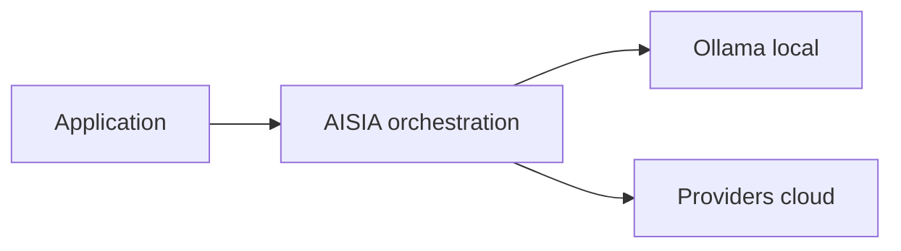

<!-- GENERATED:09_publications:start -->
<!--
  GÉNÉRÉ — ne pas éditer à la main.
  Source: scripts/generate/09_publications.py
  Régénérer: python3 scripts/aisia.py regen
  Gate deploy: python3 scripts/release/deploy.py <ver> --mode docs
-->

# terraform-aisia-cluster

> **v6.12.33** — module cœur — déployer AISIA sur Kubernetes existant

## Cœur d'AISIA (identité produit)

AISIA est le **chef d'orchestre IA local-first** : une requête entre, le meilleur modèle (local ou cloud) exécute, la réponse sort traçable et gouvernée.

**Fonction première** : orchestrer chaque requête IA en **local-first** (Ollama sur cluster)
puis cloud si nécessaire — via `BanditRouter`, pas un simple reverse-proxy.

**Différenciation** : orchestration local-first — pas un proxy LLM stateless.

| vs proxy LLM | AISIA |
|--------------|-------|
| 1 provider fixe | **88** providers + **58** modèles locaux |
| Stateless | Qdrant + audit AI Act + multi-tenant |
| SaaS opaque | Déployable Swarm/K8s — **v6.12.33** LIVE |

Documentation : [README racine](../../../../README.md) ·
[Product Identity](../../../../specification/03-Project-State/Product-Identity-AISIA.md)




---
<!-- GENERATED:09_publications:end -->

## À propos d'AISIA

AISIA = orchestration d'IA **souveraine, local-first, multi-providers**. Elle route
chaque requête IA vers le meilleur modèle (cloud **ou** local) au meilleur coût,
sans lock-in, en gardant la maîtrise des données (RGPD/EU AI Act). **Problèmes
résolus** : coûts LLM (routage cost-aware + modèles locaux), lock-in
(providers unifiés + fallback), souveraineté (on-prem/cloud souverain, audit),
fiabilité (HA), multi-tenant (SaaS/BaaS/PaaS). **Ce module déploie** la plateforme ;
le provider [`AISIA/aisia`](https://app.terraform.io/app/AISIA/registry/providers/private/AISIA/aisia) la **gère**.

> ℹ️ AISIA est une solution **propriétaire** (brevet / dépôt INPI). Ce module documente
> **comment déployer/exploiter** la plateforme, pas son architecture interne ni sa conception.

Publié sur le Terraform Registry sous `terraform-kubernetes-aisia`.

## Usage

```hcl
module "aisia" {
  source  = "aisia-foundation/cluster/aisia"
  version = "~> 1.0"

  image_tag          = "v6.12.33"
  domain             = "client.aisia.fr"
  tier               = "saas"     # free | saas | baas | paas
  enable_autoscaling = true
  enable_tls         = true
}
```

Voir [`examples/basic`](./examples/basic) pour un exemple complet.

## Tiers & scalabilité

Le `tier` dérive les bornes HPA par défaut (surcharge possible via
`api_replicas_min/max`) :

| tier | min | max |
|------|-----|-----|
| free | 1 | 2 |
| saas | 2 | 6 |
| baas | 2 | 10 |
| paas | 3 | 20 |

## Inputs

| Nom | Type | Défaut | Description |
|-----|------|--------|-------------|
| `image_tag` | string | — (requis) | Tag d'image AISIA (ex. `v6.12.33`) |
| `namespace` | string | `aisia` | Namespace cible |
| `create_namespace` | bool | `true` | Créer le namespace |
| `image_registry` | string | `registry.aisia.fr` | Registry des images |
| `domain` | string | `""` | Domaine public (vide = pas d'Ingress) |
| `tier` | string | `saas` | `free`/`saas`/`baas`/`paas` |
| `enable_autoscaling` | bool | `true` | HPA sur l'API |
| `api_replicas_min/max` | number | dérivé du tier | Bornes HPA |
| `api_cpu_target` | number | `70` | Cible CPU % autoscaling |
| `enable_tls` | bool | `true` | TLS via cert-manager |
| `cluster_issuer` | string | `letsencrypt-prod` | ClusterIssuer cert-manager |
| `backup_schedule` | string | `0 3 * * *` | Cron backups (vide = off) |
| `storage_class` | string | `""` | StorageClass des PV |
| `extra_env` | map(string) | `{}` | Env supplémentaires API |

## Outputs

| Nom | Description |
|-----|-------------|
| `namespace` | Namespace de déploiement |
| `api_service` | Nom du Service API |
| `api_endpoint_internal` | Endpoint interne cluster |
| `public_url` | URL publique (si `domain`) |
| `autoscaling` | Bornes de scaling effectives |
| `tier` | Tier appliqué |

## Prérequis

- Cluster Kubernetes ≥ 1.27 + kubeconfig.
- `cert-manager` (si `enable_tls`) avec un `ClusterIssuer`.
- Un Ingress controller (nginx) si `domain` fourni.

## Requirements

| Name | Version |
|------|---------|
| terraform | >= 1.5.0 |
| kubernetes | >= 2.27.0 |
| helm | >= 2.13.0 |

## Licence

MPL-2.0 — voir [LICENSE](./LICENSE).

## Référence des variables & sorties (auto-générée)

<!-- BEGIN_TF_DOCS -->
<!-- END_TF_DOCS -->

<!-- TF-MODULE-DOCS:09_publications -->
## Documentation AISIA

- **Documentation produit** : [aisia.fr/docs](https://aisia.fr/docs)
- **Référence API** : [api.aisia.fr/docs](https://api.aisia.fr/docs)
- **Provider Terraform** : [aisia-foundation/aisia](https://registry.terraform.io/providers/aisia-foundation/aisia/latest/docs)
- **Guide d'implémentation** : [getting-started](https://registry.terraform.io/providers/aisia-foundation/aisia/latest/docs/guides/getting-started)
- **Version LIVE** : **v6.12.33**
